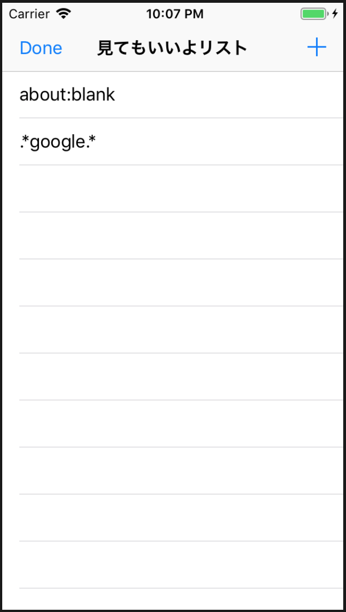
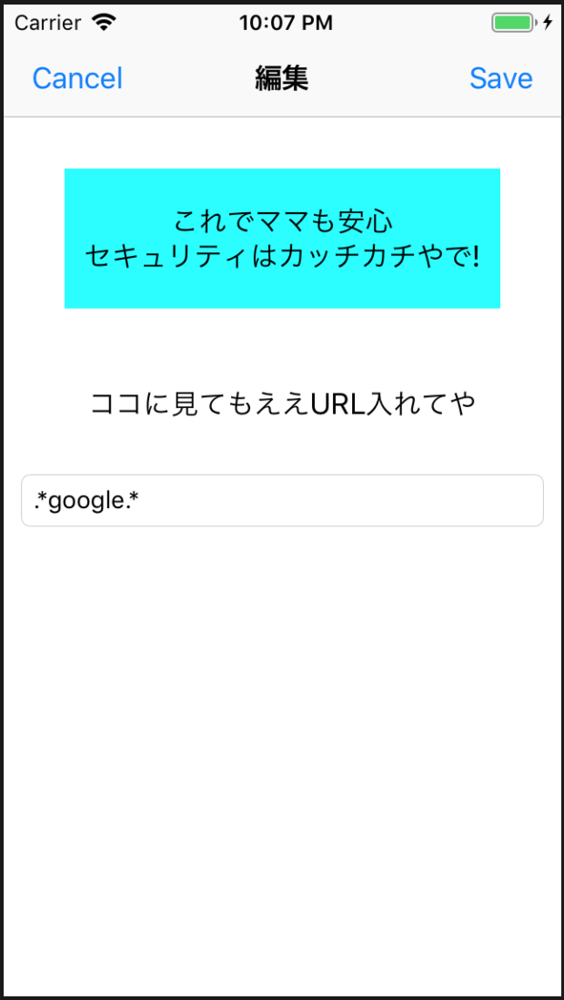
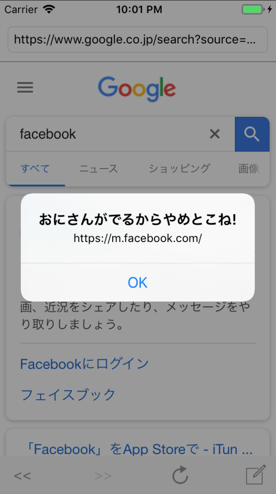

## Strict Browser

*アクセス制限キツすぎブラウザアプリ*

1. 概要

    - 子どもを危険なサイトから守るためのアプリ/誤操作にも役立つ
    - 登録したサイト/URLのみブラウジングができる
    - 正規表現の登録に対応

1. 環境

    - Xcode 10.1
    - Swift 4.2.1
    - Man-hour 3.0h

1. 学び / ポイント

    - 一覧表の作り方 / UITableViewController
    - ブラウザ機能の作り方 / UIWebView
    - データ保存/永続化の方法 / UserDefaults

1. イメージ

    |                           Screen1                           |     |                           Screen2                           |     |                           Screen3                           |
    |-------------------------------------------------------------|-----|-------------------------------------------------------------|-----|-------------------------------------------------------------|
    |  | >>> |  | >>> |  |

1. ソースコード

    [GitHub](https://github.com/nsuhara/swift-StrictBrowser.git)
